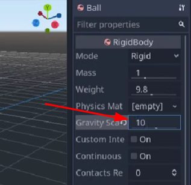

# chiBang

simple godot project with vehicle sterling

current video progress:  *4:03 / 15:28*

[Godot Recipe: 3D Arcade-style Car (with a sphere) - YouTube](https://youtu.be/LqLchhxMldM?t=244)

## Settigns for chaning gamefeel

default feels a bit mushy so set it from 1 to 10

how quick the ball stops rolling, car comes to a stop

what happens when you run into a wall or other cars

not to much bounce maybe just 0.1
